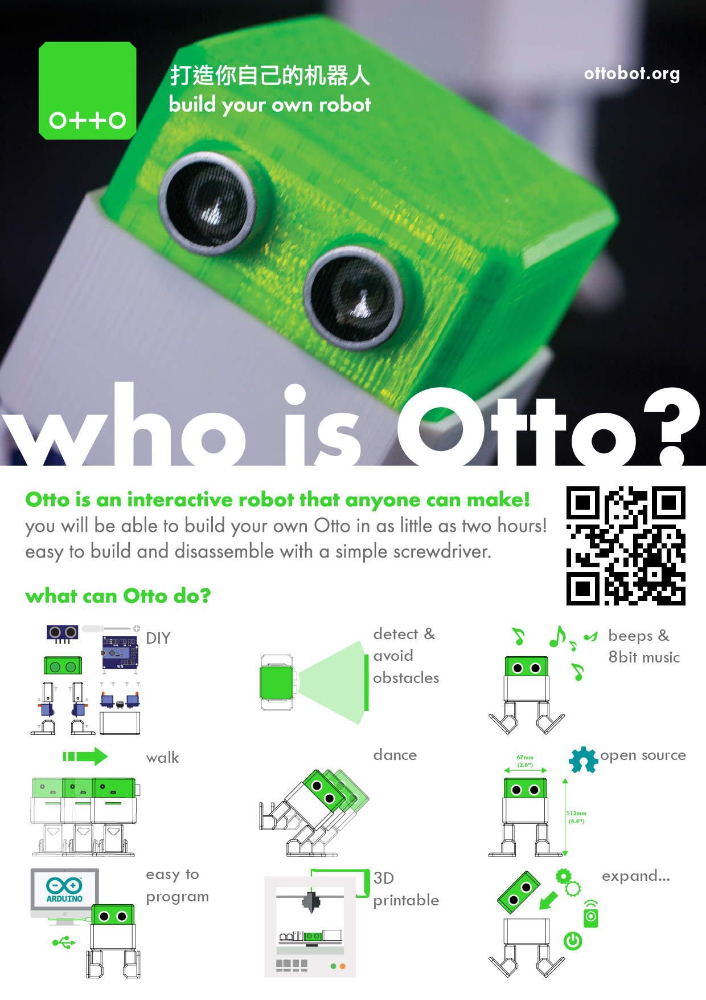

# Otto DIY

This Repository have all open source files for Otto DIY an interactive robot that anyone can make!,
[Otto walks, dances] (https://youtu.be/ZcGgz6v1efg), makes sounds and avoids obstacles.
Is completely open source, Arduino compatible, 3D printable, and with a social impact mission to create an inclusive environment for all kids.
 

## For the hardware
Gather all the off the shelf parts in the [BOM file] (https://github.com/OttoDIY/Otto/blob/master/OTTO_V02_BOM_STP_STL/OTTO_BOM.xlsx) that you'll need for this assembly, then 3d print the latest .stl files and then follow [the instruction manual] (https://github.com/OttoDIY/Otto/blob/master/OTTO_V02_BOM_STP_STL/OTTO_InstructionsManual_V04_arduino.pdf) to build your own robot
 
## For the programming
1. Download & Install Arduino IDE: https://www.arduino.cc/en/Main/Software also this driver if you have a clone board: http://www.wch.cn/download/CH341SER_EXE.html for PC, or http://www.wch.cn/download/CH341SER_MAC_ZIP.html for MAC
2. Copy all libraries to C:\Users\user\Documents\Arduino\libraries (or wherever your library folder is installed):
3. Open  for example OTTO_smooth_criminal.ino, make sure in tools you have "Board: Arduino Nano" "Processor ATmega328" and your Otto is connected to the corresponding port
4. Upload code to your Otto and will dance!
5. Make your own dance just modify the program using same functions
 

### Otto is design using Autodesk 123D Design software 
[You can modify it for customization](http://www.123dapp.com/Project/Otto-build-your-own-robot/5658683) or further improvements!

Otto was inspired by another robot BoB the BiPed and programmed using code from [another open source biped robot Zowi](https://github.com/bqlabs/zowi)
Otto's differences are in the assembled size (11cm x 7cm x12cm), cleaner integration of components and expressions. 
Using off the shelf and 3D printed parts, simple electronics connections (almost no welding required), and basic coding skills, [you will be able to build your own cute Otto friend in as little as two hours!](http://www.instructables.com/id/Otto-Build-You-Own-Robot-in-Two-Hours/)

## License CC-BY-SA
 Otto DIY by <a xmlns:cc="http://creativecommons.org/ns#"  property="cc:attributionName"> [ottobot.org](http://ottobot.org) </a> is licensed under a <a rel="license" href="http://creativecommons.org/licenses/by-sa/4.0/">Creative Commons Attribution-ShareAlike 4.0 International License</a>.
